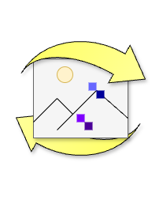

# Lossy Loop

Unleash the power of compression with **Lossy Loop**!  

```text
   __                       __                   
  / /  ___  ___ ___ _   _  / /  ___   ___  _ __  
 / /  / _ \/ __/ __| | | |/ /  / _ \ / _ \| '_ \ 
/ /__| (_) \__ \__ \ |_| / /__| (_) | (_) | |_) |
\____/\___/|___/___/\__, \____/\___/ \___/| .__/ 
                    |___/                 |_|   
```

## About

This app repeatedly compresses your uploaded JPG image up to 1000 times, showcasing the fascinating effects of lossy compression.  
Watch as your photo evolves (or devolves) into a cascade of artifacts and degraded pixels.  
Explore the beauty of destruction—one pixel at a time!

## Installation

### Go (1.23.3)

- Install Golang [Latest](https://go.dev/dl/)
  - [Windows](https://go.dev/dl/go1.23.3.windows-amd64.msi)
  - [macOS](https://go.dev/dl/go1.23.3.darwin-amd64.pkg)
  - [Linux](https://go.dev/dl/go1.23.3.linux-amd64.tar.gz)

### Docker

- [Docker Desktop](https://docs.docker.com/get-started/get-docker/)
- [Docker CE (Ubuntu)](https://docs.docker.jp/engine/installation/linux/docker-ce/ubuntu.html)

## Usage

### Go

- Save your photo in `./input`
- Set up
  - `go mod init github.com/cyokozai/lossyloop`
  - `go mod tidy`
- Run code
  - `go run ./src/main.go [quality] [iteration] [method]`
    - quality: `1 ~ 100` (default: 10) or `random`
    - iteration: `1 ~ 1000` (default: 200)
    - method: `jpg` (`jpeg`) or `webp` (default: jpg)
- Build code
  - `cd ./src`
  - `go build -v -o ../lossyloop`
  - `cd ..`
  - `./lossyloop [quality] [method]`
    - quality: `1 ~ 100` (default: 10) or `random`
    - iteration: `1 ~ 1000` (default: 200)
    - method: `jpg` (`jpeg`) or `webp` (default: jpg)

### Docker

- Save your photo in `./input`
- Compose up
  - `docker compose up -d --build`

## Example


